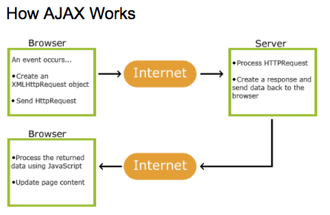

# Hot-Restaurant
With this application, the goal is to have the front and the back end talk to each other. 
Take  reservations or put people on a waiting list.  Also make new reservations and go back home from any page.  When server is restarted, the reservations will disappear because data is living only on the server, it is not hard coded.  

# Getting Started

# Basic Structure
Data and logic live on the Node server.  Routes make the data and logic accessible.  Ajax is used on those routes to push changes on the client front end side.

# To install
* Git Clone the repository
* Navigate to the folder where the repository exists
* Run the command $ npm init
* Run the command $ npm install body-parser express --save
* Then run the command $ node server.js

* Browser start with search for localhost:8080 
    * NOTE: started with [app.listen(3000)](https://expressjs.com/en/starter/hello-world.html) from express documentation but changed to var PORT = process.env.PORT || 8080

# Built With
* [Body-Parser](https://www.npmjs.com/package/body-parser) allows us to receive our information back in [JSON](https://en.wikipedia.org/wiki/JSON#Example) format for easy manipulation.
* [Express](https://www.npmjs.com/package/express) makes routing easy using Node.js by setting var app = express(); so we can easily call it.
    * Features robust routing
    * HTTP helpers
    * Generates applications quickly
* [Using res.sendFile()](https://scotch.io/tutorials/use-expressjs-to-deliver-html-files) to deliver HTML Files
* [AJAX](https://www.w3schools.com/xml/ajax_intro.asp) is a technique for accessing web servers from a web page.  It stands for Asynchronous JavaScript And XML and it is not a programming language.

# Authors

* Sonia Molina Bradley

# License
This project is licensed under the [MIT](https://github.com/expressjs/body-parser/blob/master/LICENSE) License 

# Acknowledgments

* You Tube 
* Boot Camp Github Respository
* Duy Do

# To Do
Run through Sequel Pro

